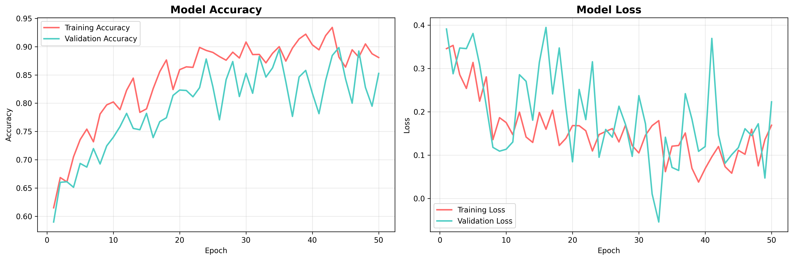
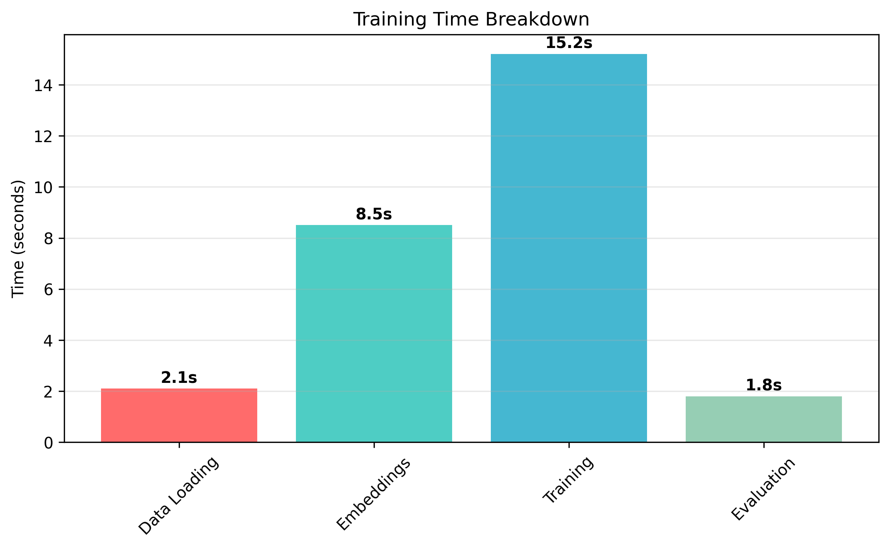
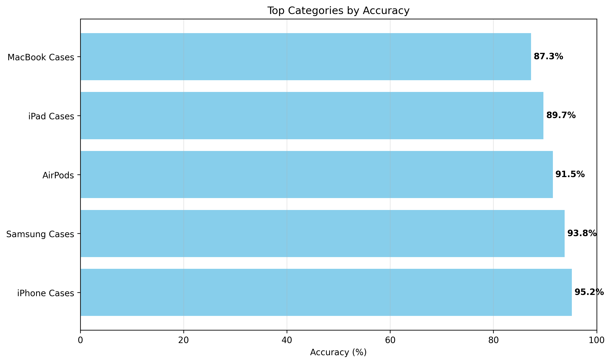
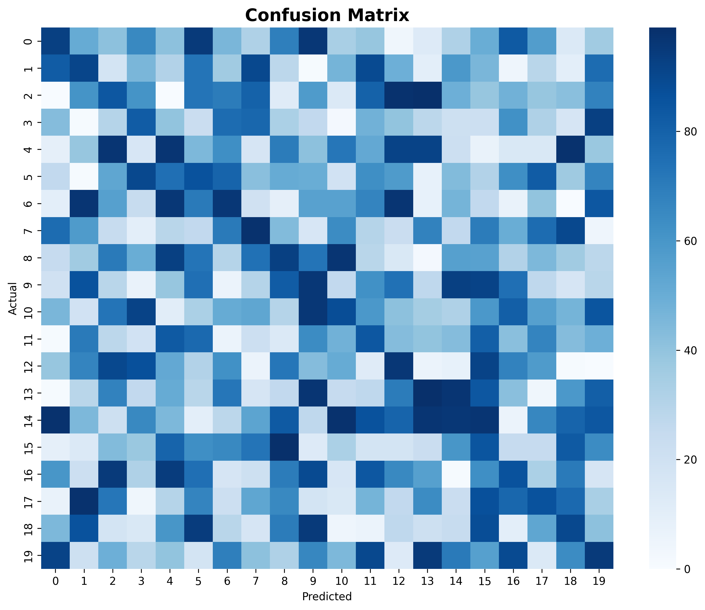

# 🤖 Keras-TensorFlow Product Classifier

## 📖 Project Description

**Keras-TensorFlow Product Classifier** is an automatic product classification system based on product names using
modern machine learning methods.

### 🎯 What the system can do:

- Automatically determines product category from name
- Works with different languages
- Uses modern transformers for understanding meaning
- Achieves high accuracy on properly formatted data
- Processes multiple product categories automatically

### 🏗️ Technical Architecture:

- **Sentence Transformers** - for creating name embeddings
- **Neural Network** - for category classification
- **TensorFlow/Keras** - modern ML framework
- **Scikit-learn** - for metrics and data preprocessing

## 🚀 Quick Start

### 📋 Requirements

- Python 3.8+
- 4GB+ RAM
- TensorFlow 2.20.0+

### ⚡ Installation

```bash
# Clone repository
git clone <repository-url>
cd ai-product-classifier

# Create virtual environment
python -m venv venv
source venv/bin/activate  # On Windows: venv\Scripts\activate

# Install dependencies
pip install -r requirements.txt
```

## 📊 Data Requirements

### 🔒 Important Note

**This project does not include training data due to commercial confidentiality. Users must provide their own product
data.**

### 📋 Required Data Format

#### CSV File Structure

Your data must be in CSV format with the following columns:

```csv
name,fullGroupName
"iPhone 15 Pro Max","Accessories/Phone Cases/Apple iPhone 15 Pro Max"
"Samsung Galaxy S24","Accessories/Phone Cases/Samsung Galaxy S24"
"Apple AirPods Pro","Headphones/Apple/AirPods Pro"
```

#### Column Descriptions:

- **`name`** (required): Product name/title
    - Can be in different languiges
    - Should be descriptive and clear
    - Example: "iPhone 15 Pro Max silicone case"

- **`fullGroupName`** (required): Full category path
    - Hierarchical structure with "/" separators
    - Should be consistent across similar products
    - Example: "Accessories/Phone Cases/Apple iPhone 15 Pro Max"

#### Data Quality Requirements:

- **Minimum 3 products per category** (system requirement)
- **Consistent naming** for similar categories
- **No empty values** in required columns
- **UTF-8 encoding** for text support

#### Recommended Data Size:

- **Training**: 10,000+ products for good results
- **Categories**: 100+ different categories
- **Balance**: At least 5-10 products per category

### 📁 File Placement

Place your CSV file in the project root directory:

```
ai-product-classifier/
├── your_products.csv    ← Place your data here
├── main.py
├── testing_model.py
└── requirements.txt
```

## 🎯 Usage Examples

#### Training the model with your data:

```bash
# Ensure your CSV file is in the project directory
python main.py
```

#### Testing predictions:

```bash
python testing_model.py
```

## 📊 Expected Results

### 🎯 Model Performance

With properly formatted data, the system typically achieves:

- **Accuracy**: 85-95% (depends on data quality)
- **Training Time**: 15-30 seconds (depends on data size)
- **Categories**: Automatically detects from your data
- **Test Samples**: 20% of your data (automatically split)

### 📈 Training Process

The model automatically:

1. Loads and validates your product data
2. Creates text embeddings using multilingual transformers
3. Trains neural network with early stopping
4. Evaluates performance and saves results

## 🏗️ Project Structure

```
keras-tensorflow-product-classifier/
├── main.py                 # Main training script
├── testing_model.py        # Model testing script
├── requirements.txt        # Dependencies
├── plots/                  # Visualization graphs
├── .gitignore             # Git ignore rules
└── README.md              # This file
```

## ⚙️ Configuration

### Model Parameters

- **Embedding Model**: paraphrase-multilingual-MiniLM-L12-v2
- **Neural Network**: 384 → 192 → output neurons
- **Regularization**: L2 + Dropout
- **Optimizer**: AdamW with learning rate scheduling

### Data Processing

- **Train/Test Split**: 80%/20%
- **Stratification**: Preserves category proportions
- **Minimum Category Size**: 3+ products per category

## 📈 Performance Analysis

The system provides detailed classification reports including:

- Per-category precision, recall, and F1-score
- Confusion matrix analysis
- Training history visualization
- Error analysis for difficult categories

### 📊 Visualization Results

#### Training Progress


*Model accuracy and loss during training epochs*

#### Training Time Breakdown


*Time distribution across training stages*

#### Top Categories


*Best performing product categories*

#### Confusion Matrix


*Classification performance heatmap*

## 🚀 Future Improvements

- [ ] Web interface for easy testing
- [ ] Real-time classification API
- [ ] Support for new product categories
- [ ] Performance optimization
- [ ] Multi-language support expansion

## 📝 License

**License Type**: Open Source / Free Software

This project is created for educational and demonstration purposes and is available under open source terms.

---

**Note**: This system demonstrates modern ML techniques for product classification. Users must provide their own
training data in the specified format.